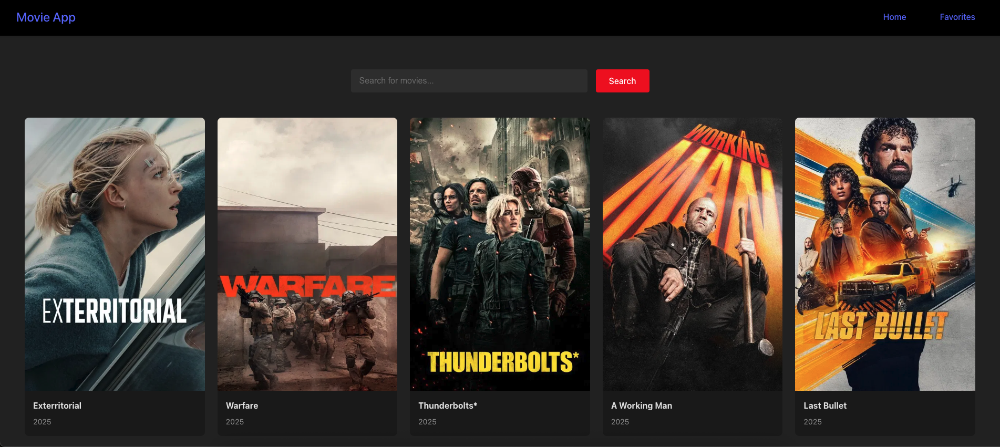

# 🎬 React Movie Favorites

A simple React app that lets users browse and favorite movies using The Movie Database (TMDB) API. Built as a hands-on project to learn React concepts like components, context, hooks, and localStorage.

## 🚀 Features

- Browse trending movies (from TMDB)
- Click to favorite/unfavorite movies
- Favorites are stored in localStorage
- View your list of favorite movies

## 🛠️ Built With

- React
- Context API
- CSS Modules
- TMDB API

## 📸 Screenshots




## 🧑‍💻 Getting Started

```bash
git clone https://github.com/Mshumaman/react-movie-faves.git
cd react-movie-faves
npm install
npm run dev
```

## 💡 Credit

Based on the Tech With Tim tutorial.